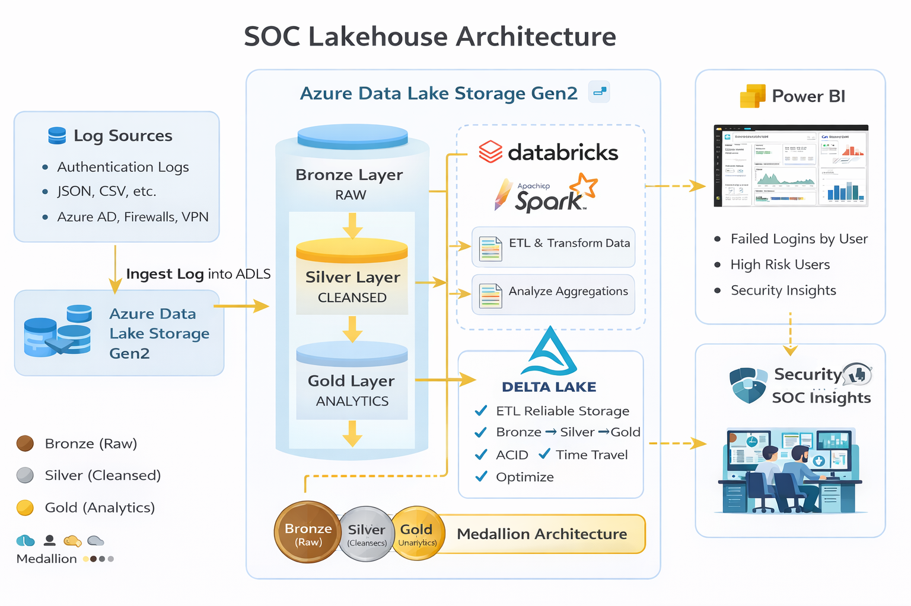

# SOC Lakehouse Architecture

This project follows a modern **lakehouse architecture** to analyze security logs and detect risky authentication behavior using Azure services.

---

## Architecture Overview

The solution ingests security log data into Azure Data Lake Storage Gen2 and processes it using Azure Databricks following a **Bronze–Silver–Gold** data model. Curated insights are visualized in Power BI with security-focused dashboards.

---

## Components

### 🔹 Data Source
- SOC / authentication log data (JSON format)
- Represents failed login and security events

### 🔹 Storage Layer – ADLS Gen2
- **Raw (Bronze):** Original log files
- **Silver:** Cleaned, structured data
- **Gold:** Aggregated datasets for analytics

### 🔹 Processing Layer – Azure Databricks
- Apache Spark notebooks
- Delta Lake format for reliability
- ETL pipelines:
  - Raw → Silver transformation
  - Silver → Gold aggregations

### 🔹 Analytics Layer – Power BI
- Failed login attempts by user
- Security risk summaries
- Interactive filtering and drill-down
- AI-powered narrative (optional)

---

## Data Flow

1. Logs are ingested into ADLS Gen2 (Raw layer)
2. Databricks cleans and normalizes data (Silver)
3. Aggregations are created for analytics (Gold)
4. Power BI connects to Gold tables for visualization

---

## Design Benefits

- Scalable lakehouse design
- Separation of raw and curated data
- Optimized analytics performance
- Security and audit friendly

---

## Architecture Diagram

